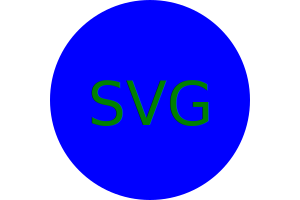

# 10 Object-oriented Programming: SVG Logo Maker

## Your Task

Your task is to build a Node.js command-line application that takes in user input to generate a logo and save it as an [SVG file](https://en.wikipedia.org/wiki/Scalable_Vector_Graphics). The application prompts the user to select a color and shape, provide text for the logo, and save the generated SVG to a `.svg` file.

Because this application won’t be deployed, you’ll need to provide a link to a walkthrough video that demonstrates its functionality and passes all of the tests. You’ll need to submit a link to the video **and** add it to the README of your project.

Refer to the [Video Submission Guide](https://coding-boot-camp.github.io/full-stack/computer-literacy/video-submission-guide) on the Full-Stack Blog for additional guidance on creating a video.

> **Note**: There is no starter code for this assignment.
### User Story

```md
AS a freelance web developer
I WANT to generate a simple logo for my projects
SO THAT I don't have to pay a graphic designer
```

## Acceptance Criteria

```md
GIVEN a command-line application that accepts user input
WHEN I am prompted for text
THEN I can enter up to three characters
WHEN I am prompted for the text color
THEN I can enter a color keyword (OR a hexadecimal number)
WHEN I am prompted for a shape
THEN I am presented with a list of shapes to choose from: circle, triangle, and square
WHEN I am prompted for the shape's color
THEN I can enter a color keyword (OR a hexadecimal number)
WHEN I have entered input for all the prompts
THEN an SVG file is created named `logo.svg`
AND the output text "Generated logo.svg" is printed in the command line
WHEN I open the `logo.svg` file in a browser
THEN I am shown a 300x200 pixel image that matches the criteria I entered
```


## Installation

1. Clone the repository into any source code editor.
2. Open the integrated terminal and run npm  install to download required dependencies.
3. Run node index.js to initiate the program.
4. Follow the on screen instructions to create your custom logo.
5. Once you are satisfied with your design save it as 'logo.svg'.</s>

# Clone Repo


# Running Program


# Finished Image

